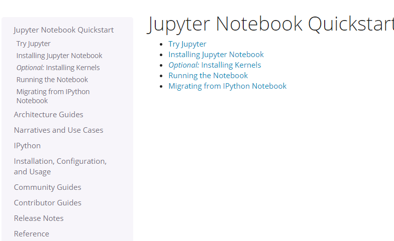

<https://jupyterlab.readthedocs.io/en/stable/getting_started/installation.html>

The following is the screenshot.

conda install -c conda-forge/label/broken jupyterlab 

<http://localhost:8888/?token=7b50e8eeb9c4a220f8b0be4a020372bf3551c8d1b4aa211c>

<https://jupyter.readthedocs.io/en/latest/content-quickstart.html>

The following is the screenshot.

