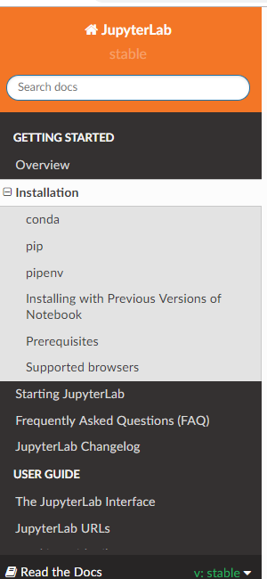

https://jupyterlab.readthedocs.io/en/stable/getting_started/installation.html
(screenshot below)

(Try the following code on the command line if Jupyter Lab does not lunch)

conda install -c conda-forge/label/broken jupyterlab 

<http://localhost:8888/?token=7b50e8eeb9c4a220f8b0be4a020372bf3551c8d1b4aa211c>

(The following URL has includes a good description of various aspects of Jupyter
notebook (Predecessor of Jupyter Lab)

<https://jupyter.readthedocs.io/en/latest/content-quickstart.html>

Use [Jupytext](https://towardsdatascience.com/introducing-jupytext-9234fdff6c57)
if you want to have Jupyter notebooks as Python scripts

Jupytext can convert notebooks to and from

-   Julia, Python and R scripts (extensions .jl, .py and .R),

-   Markdown documents (extension .md),

-   R Markdown documents (extension .Rmd).

[Jupytext](https://github.com/mwouts/jupytext/blob/master/README.md) is
available on [pypi](https://pypi.org/project/jupytext/). Install the python
package and configure Jupyter to use Jupytext’s content manager:

\# Get Jupytext from pip  
pip install jupytext --upgrade

\# Append this to .jupyter/jupyter_notebook_config.py
c.NotebookApp.contents_manager_class="jupytext.TextFileContentsManager"

\# And restart your notebook server  
jupyter notebook

Jupyter notebooks as Markdown documents, Julia, Python or R scripts
-------------------------------------------------------------------

Paired Notebooks
----------------

Paired notebooks let you store an .ipynb file alongside the text-only version.
Paired notebooks can be enabled by adding a jupytext_formats entry to the
notebook metadata with Edit/Edit Notebook Metadata in Jupyter’s menu.

On saving the notebook, both the Jupyter notebook and
the [python](https://subscription.packtpub.com/tech/python) scripts are updated.

[Working efficiently with JupyterLab Notebooks - By Florian
Wilhelm](https://florianwilhelm.info/2018/11/working_efficiently_with_jupyter_lab/)
(Excellent Web Post)

[Navigator Error no ipython console is currently available to run temp.py in
spyder 3.2.7](https://github.com/ContinuumIO/anaconda-issues/issues/8726)

Open a terminal (on Linux or Mac) or the Anaconda Command Prompt (on windows)
and type:

\$ conda update conda

\$ conda update anaconda-navigator

\$ conda update navigator-updater

NOTE: If you see this error when updating anaconda:

PackageNotInstalledError: Package is not installed in prefix.  
      package name: anaconda

   
Install Anaconda to update the distribution to Python 3.6:

conda install anaconda
